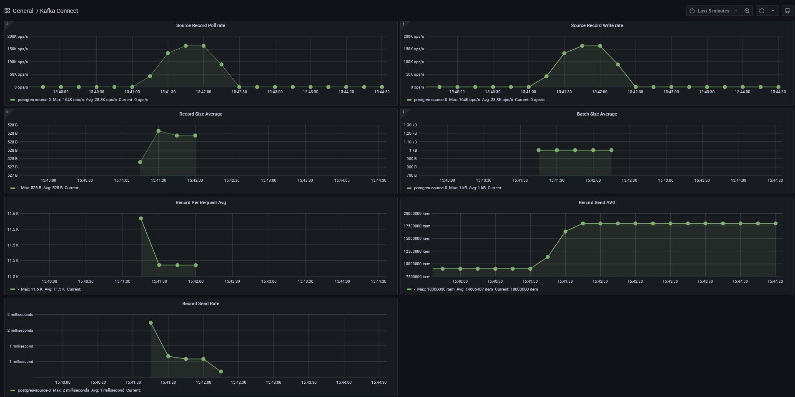

# Проект 3-го спринта


[](http://localhost:9090)
[](http://localhost:3000)


### Описание
Репозиторий предназначен для сдачи проекта 3-го спринта

### Как запустить контейнер
Сборка толстого jar файла:

```
gradlew clean kafka-connect-prometheus:shadowJar
```

Запустите локально Docker:

```shell
cd infra; docker-compose up -d
```

### Оптимизация параметров для повышения пропускной способности JDBC Source Connector
| Эксперимент |   batch.size    |  linger.ms   |       compression.type        |              buffer.memory              | Source Record<br/>Write Rate<br/>(кops/sec) |
|:-----------:|:---------------:|:------------:|:-----------------------------:|:---------------------------------------:|:-------------------------------------------:|
|      1      |       500       |     1000     |             none              |                33554432                 |                    9.06                     |
|      2      |      52800      |     1000     |             gzip              |                33554432                 |                     147                     |
|      3      |      52800      |     1000     |            snappy             |                33554432                 |                     154                     |
|      4      |     528000      |     1000     |             gzip              |                67108864                 |                     154                     |
|      5      |     528000      |     1000     |            snappy             |                67108864                 |                     164                     |

Вывод: оптимальным результатом считается 5 эксперимент, ```batch.size = batch.max.rows * record_size_average_in_bytes``` вычислили по формуле, использовали аллгоритм сжатия snappy, увеличили размер буффера в 2 раза, с учетом возмозжности увеличения самого batcha данных.

#### Отправьте PUT запрос на конфигурирование коннектора
```shell
curl -X PUT \
-H "Content-Type: application/json" \
--data @kafka-connect/config/jdbc-source-connector.json \
http://localhost:8083/connectors/postgres-source/config
```

#### Отправьте GET запрос на получение статуса коннектора
```shell
curl http://localhost:8083/connectors/postgres-source/status | jq
```

#### Ожидаемый результат
```json
{
  "name": "postgres-source",
  "connector": {
    "state": "RUNNING",
    "worker_id": "localhost:8083"
  },
  "tasks": [
    {
      "id": 0,
      "state": "RUNNING",
      "worker_id": "localhost:8083"
    }
  ],
  "type": "source"
}
```

#### Дашборд
<p float="center">
  
</p>

### Создание собственного коннектора для переноса данных из Apache Kafka в Prometheus
#### Отправьте POST запрос на конфигурирование коннектора
```shell
curl -X POST \
-H "Content-Type: application/json" \
--data @kafka-connect/config/prometheus-sink-connector.json \
http://localhost:8083/connectors
```

#### Отправьте GET запрос на получение статуса коннектора
```shell
curl http://localhost:8083/connectors/prometheus-sink-connector/status | jq
```

#### Ожидаемый результат
```json
{
  "name": "prometheus-sink-connector",
  "connector": {
    "state": "RUNNING",
    "worker_id": "localhost:8083"
  },
  "tasks": [
    {
      "id": 0,
      "state": "RUNNING",
      "worker_id": "localhost:8083"
    }
  ],
  "type": "sink"
}
```

#### Отправьте в metrics-topic json
```json
{
    "Alloc": {
        "Type": "gauge",
        "Name": "Alloc",
        "Description": "Alloc is bytes of allocated heap objects.",
        "Value": 24293912
    },
    "FreeMemory": {
        "Type": "gauge",
        "Name": "FreeMemory",
        "Description": "RAM available for programs to allocate",
        "Value": 7740977152
    },
    "PollCount": {
        "Type": "counter",
        "Name": "PollCount",
        "Description": "PollCount is quantity of metrics collection iteration.",
        "Value": 3
    },
    "TotalMemory": {
        "Type": "gauge",
        "Name": "TotalMemory",
        "Description": "Total amount of RAM on this system",
        "Value": 16054480896
    }
}
```

#### Ожидаемый результат
```text
# HELP TotalMemory Total amount of RAM on this system
# TYPE TotalMemory gauge
TotalMemory 1.6054480896E10
# HELP PollCount_total PollCount is quantity of metrics collection iteration.
# TYPE PollCount_total counter
PollCount_total 3.0
# HELP FreeMemory RAM available for programs to allocate
# TYPE FreeMemory gauge
FreeMemory 7.740977152E9
# HELP Alloc Alloc is bytes of allocated heap objects.
# TYPE Alloc gauge
Alloc 2.4293912E7
```

### Получение лога вывода Debezium PostgresConnector
#### Отправьте PUT запрос на конфигурирование коннектора
```shell
curl -X PUT \
-H "Content-Type: application/json" \
--data @kafka-connect/config/debezium-source-pg-connector.json \
http://localhost:8083/connectors/postgres-source-debezium/config
```

#### Отправьте GET запрос на получение статуса коннектора
```shell
curl http://localhost:8083/connectors/postgres-source-debezium/status | jq
```

#### Ожидаемый результат
```json
{
  "name": "postgres-source-debezium",
  "connector": {
    "state": "RUNNING",
    "worker_id": "localhost:8083"
  },
  "tasks": [
    {
      "id": 0,
      "state": "RUNNING",
      "worker_id": "localhost:8083"
    }
  ],
  "type": "source"
}
```

#### Лог вывода
```text
2025-04-06 19:48:11 [2025-04-06 16:48:11,456] INFO Loading the custom source info struct maker plugin: io.debezium.connector.postgresql.PostgresSourceInfoStructMaker (io.debezium.config.CommonConnectorConfig)
2025-04-06 19:48:11 [2025-04-06 16:48:11,567] INFO Successfully tested connection for jdbc:postgresql://postgres:5432/customers with user 'postgres-user' (io.debezium.connector.postgresql.PostgresConnector)
2025-04-06 19:48:11 [2025-04-06 16:48:11,576] INFO Connection gracefully closed (io.debezium.jdbc.JdbcConnection)
2025-04-06 19:48:11 [2025-04-06 16:48:11,578] INFO AbstractConfig values: 
2025-04-06 19:48:11  (org.apache.kafka.common.config.AbstractConfig)
2025-04-06 19:48:11 [2025-04-06 16:48:11,584] INFO [Worker clientId=connect-localhost:8083, groupId=kafka-connect] Connector pg-connector config updated (org.apache.kafka.connect.runtime.distributed.DistributedHerder)
2025-04-06 19:48:11 [2025-04-06 16:48:11,585] INFO [Worker clientId=connect-localhost:8083, groupId=kafka-connect] Rebalance started (org.apache.kafka.connect.runtime.distributed.WorkerCoordinator)
2025-04-06 19:48:11 [2025-04-06 16:48:11,585] INFO [Worker clientId=connect-localhost:8083, groupId=kafka-connect] (Re-)joining group (org.apache.kafka.connect.runtime.distributed.WorkerCoordinator)
2025-04-06 19:48:11 [2025-04-06 16:48:11,587] INFO [Worker clientId=connect-localhost:8083, groupId=kafka-connect] Successfully joined group with generation Generation{generationId=2, memberId='connect-localhost:8083-272b6579-b27e-44f9-ada1-127340333c8f', protocol='sessioned'} (org.apache.kafka.connect.runtime.distributed.WorkerCoordinator)
2025-04-06 19:48:11 [2025-04-06 16:48:11,590] INFO [Worker clientId=connect-localhost:8083, groupId=kafka-connect] Successfully synced group in generation Generation{generationId=2, memberId='connect-localhost:8083-272b6579-b27e-44f9-ada1-127340333c8f', protocol='sessioned'} (org.apache.kafka.connect.runtime.distributed.WorkerCoordinator)
2025-04-06 19:48:11 [2025-04-06 16:48:11,590] INFO [Worker clientId=connect-localhost:8083, groupId=kafka-connect] Joined group at generation 2 with protocol version 2 and got assignment: Assignment{error=0, leader='connect-localhost:8083-272b6579-b27e-44f9-ada1-127340333c8f', leaderUrl='http://localhost:8083/', offset=2, connectorIds=[pg-connector], taskIds=[], revokedConnectorIds=[], revokedTaskIds=[], delay=0} with rebalance delay: 0 (org.apache.kafka.connect.runtime.distributed.DistributedHerder)
2025-04-06 19:48:11 [2025-04-06 16:48:11,590] INFO [Worker clientId=connect-localhost:8083, groupId=kafka-connect] Starting connectors and tasks using config offset 2 (org.apache.kafka.connect.runtime.distributed.DistributedHerder)
2025-04-06 19:48:11 [2025-04-06 16:48:11,591] INFO [Worker clientId=connect-localhost:8083, groupId=kafka-connect] Starting connector pg-connector (org.apache.kafka.connect.runtime.distributed.DistributedHerder)
2025-04-06 19:48:11 [2025-04-06 16:48:11,593] INFO Creating connector pg-connector of type io.debezium.connector.postgresql.PostgresConnector (org.apache.kafka.connect.runtime.Worker)
2025-04-06 19:48:11 [2025-04-06 16:48:11,593] INFO SourceConnectorConfig values: 
2025-04-06 19:48:11     config.action.reload = restart
2025-04-06 19:48:11     connector.class = io.debezium.connector.postgresql.PostgresConnector
2025-04-06 19:48:11     errors.log.enable = false
2025-04-06 19:48:11     errors.log.include.messages = false
2025-04-06 19:48:11     errors.retry.delay.max.ms = 60000
2025-04-06 19:48:11     errors.retry.timeout = 0
2025-04-06 19:48:11     errors.tolerance = none
2025-04-06 19:48:11     exactly.once.support = requested
2025-04-06 19:48:11     header.converter = null
2025-04-06 19:48:11     key.converter = null
2025-04-06 19:48:11     name = pg-connector
2025-04-06 19:48:11     offsets.storage.topic = null
2025-04-06 19:48:11     predicates = []
2025-04-06 19:48:11     tasks.max = 1
2025-04-06 19:48:11     tasks.max.enforce = true
2025-04-06 19:48:11     topic.creation.groups = []
2025-04-06 19:48:11     transaction.boundary = poll
2025-04-06 19:48:11     transaction.boundary.interval.ms = null
2025-04-06 19:48:11     transforms = [unwrap]
2025-04-06 19:48:11     value.converter = null
2025-04-06 19:48:11  (org.apache.kafka.connect.runtime.SourceConnectorConfig)
2025-04-06 19:48:11 [2025-04-06 16:48:11,594] INFO EnrichedConnectorConfig values: 
2025-04-06 19:48:11     config.action.reload = restart
2025-04-06 19:48:11     connector.class = io.debezium.connector.postgresql.PostgresConnector
2025-04-06 19:48:11     errors.log.enable = false
2025-04-06 19:48:11     errors.log.include.messages = false
2025-04-06 19:48:11     errors.retry.delay.max.ms = 60000
2025-04-06 19:48:11     errors.retry.timeout = 0
2025-04-06 19:48:11     errors.tolerance = none
2025-04-06 19:48:11     exactly.once.support = requested
2025-04-06 19:48:11     header.converter = null
2025-04-06 19:48:11     key.converter = null
2025-04-06 19:48:11     name = pg-connector
2025-04-06 19:48:11     offsets.storage.topic = null
2025-04-06 19:48:11     predicates = []
2025-04-06 19:48:11     tasks.max = 1
2025-04-06 19:48:11     tasks.max.enforce = true
2025-04-06 19:48:11     topic.creation.groups = []
2025-04-06 19:48:11     transaction.boundary = poll
2025-04-06 19:48:11     transaction.boundary.interval.ms = null
2025-04-06 19:48:11     transforms = [unwrap]
2025-04-06 19:48:11     transforms.unwrap.add.fields = []
2025-04-06 19:48:11     transforms.unwrap.add.fields.prefix = __
2025-04-06 19:48:11     transforms.unwrap.add.headers = []
2025-04-06 19:48:11     transforms.unwrap.add.headers.prefix = __
2025-04-06 19:48:11     transforms.unwrap.delete.handling.mode = rewrite
2025-04-06 19:48:11     transforms.unwrap.delete.tombstone.handling.mode = null
2025-04-06 19:48:11     transforms.unwrap.drop.fields.from.key = false
2025-04-06 19:48:11     transforms.unwrap.drop.fields.header.name = null
2025-04-06 19:48:11     transforms.unwrap.drop.fields.keep.schema.compatible = true
2025-04-06 19:48:11     transforms.unwrap.drop.tombstones = false
2025-04-06 19:48:11     transforms.unwrap.negate = false
2025-04-06 19:48:11     transforms.unwrap.predicate = null
2025-04-06 19:48:11     transforms.unwrap.route.by.field = 
2025-04-06 19:48:11     transforms.unwrap.type = class io.debezium.transforms.ExtractNewRecordState
2025-04-06 19:48:11     value.converter = null
2025-04-06 19:48:11  (org.apache.kafka.connect.runtime.ConnectorConfig$EnrichedConnectorConfig)
2025-04-06 19:48:11 [2025-04-06 16:48:11,595] INFO 172.30.0.1 - - [06/Apr/2025:16:48:11 +0000] "PUT /connectors/pg-connector/config HTTP/1.1" 201 827 "-" "curl/8.2.1" 195 (org.apache.kafka.connect.runtime.rest.RestServer)
2025-04-06 19:48:11 [2025-04-06 16:48:11,596] INFO EnrichedSourceConnectorConfig values: 
2025-04-06 19:48:11     config.action.reload = restart
2025-04-06 19:48:11     connector.class = io.debezium.connector.postgresql.PostgresConnector
2025-04-06 19:48:11     errors.log.enable = false
2025-04-06 19:48:11     errors.log.include.messages = false
2025-04-06 19:48:11     errors.retry.delay.max.ms = 60000
2025-04-06 19:48:11     errors.retry.timeout = 0
2025-04-06 19:48:11     errors.tolerance = none
2025-04-06 19:48:11     exactly.once.support = requested
2025-04-06 19:48:11     header.converter = null
2025-04-06 19:48:11     key.converter = null
2025-04-06 19:48:11     name = pg-connector
2025-04-06 19:48:11     offsets.storage.topic = null
2025-04-06 19:48:11     predicates = []
2025-04-06 19:48:11     tasks.max = 1
2025-04-06 19:48:11     tasks.max.enforce = true
2025-04-06 19:48:11     topic.creation.default.exclude = []
2025-04-06 19:48:11     topic.creation.default.include = [.*]
2025-04-06 19:48:11     topic.creation.default.partitions = -1
2025-04-06 19:48:11     topic.creation.default.replication.factor = -1
2025-04-06 19:48:11     topic.creation.groups = []
2025-04-06 19:48:11     transaction.boundary = poll
2025-04-06 19:48:11     transaction.boundary.interval.ms = null
2025-04-06 19:48:11     transforms = [unwrap]
2025-04-06 19:48:11     value.converter = null
2025-04-06 19:48:11  (org.apache.kafka.connect.runtime.SourceConnectorConfig$EnrichedSourceConnectorConfig)
2025-04-06 19:48:11 [2025-04-06 16:48:11,597] INFO EnrichedConnectorConfig values: 
2025-04-06 19:48:11     config.action.reload = restart
2025-04-06 19:48:11     connector.class = io.debezium.connector.postgresql.PostgresConnector
2025-04-06 19:48:11     errors.log.enable = false
2025-04-06 19:48:11     errors.log.include.messages = false
2025-04-06 19:48:11     errors.retry.delay.max.ms = 60000
2025-04-06 19:48:11     errors.retry.timeout = 0
2025-04-06 19:48:11     errors.tolerance = none
2025-04-06 19:48:11     exactly.once.support = requested
2025-04-06 19:48:11     header.converter = null
2025-04-06 19:48:11     key.converter = null
2025-04-06 19:48:11     name = pg-connector
2025-04-06 19:48:11     offsets.storage.topic = null
2025-04-06 19:48:11     predicates = []
2025-04-06 19:48:11     tasks.max = 1
2025-04-06 19:48:11     tasks.max.enforce = true
2025-04-06 19:48:11     topic.creation.default.exclude = []
2025-04-06 19:48:11     topic.creation.default.include = [.*]
2025-04-06 19:48:11     topic.creation.default.partitions = -1
2025-04-06 19:48:11     topic.creation.default.replication.factor = -1
2025-04-06 19:48:11     topic.creation.groups = []
2025-04-06 19:48:11     transaction.boundary = poll
2025-04-06 19:48:11     transaction.boundary.interval.ms = null
2025-04-06 19:48:11     transforms = [unwrap]
2025-04-06 19:48:11     transforms.unwrap.add.fields = []
2025-04-06 19:48:11     transforms.unwrap.add.fields.prefix = __
2025-04-06 19:48:11     transforms.unwrap.add.headers = []
2025-04-06 19:48:11     transforms.unwrap.add.headers.prefix = __
2025-04-06 19:48:11     transforms.unwrap.delete.handling.mode = rewrite
2025-04-06 19:48:11     transforms.unwrap.delete.tombstone.handling.mode = null
2025-04-06 19:48:11     transforms.unwrap.drop.fields.from.key = false
2025-04-06 19:48:11     transforms.unwrap.drop.fields.header.name = null
2025-04-06 19:48:11     transforms.unwrap.drop.fields.keep.schema.compatible = true
2025-04-06 19:48:11     transforms.unwrap.drop.tombstones = false
2025-04-06 19:48:11     transforms.unwrap.negate = false
2025-04-06 19:48:11     transforms.unwrap.predicate = null
2025-04-06 19:48:11     transforms.unwrap.route.by.field = 
2025-04-06 19:48:11     transforms.unwrap.type = class io.debezium.transforms.ExtractNewRecordState
2025-04-06 19:48:11     value.converter = null
2025-04-06 19:48:11  (org.apache.kafka.connect.runtime.ConnectorConfig$EnrichedConnectorConfig)
2025-04-06 19:48:11 [2025-04-06 16:48:11,600] INFO Instantiated connector pg-connector with version 3.1.0.Final of type class io.debezium.connector.postgresql.PostgresConnector (org.apache.kafka.connect.runtime.Worker)
2025-04-06 19:48:11 [2025-04-06 16:48:11,601] INFO Finished creating connector pg-connector (org.apache.kafka.connect.runtime.Worker)
2025-04-06 19:48:11 [2025-04-06 16:48:11,601] INFO [Worker clientId=connect-localhost:8083, groupId=kafka-connect] Finished starting connectors and tasks (org.apache.kafka.connect.runtime.distributed.DistributedHerder)
2025-04-06 19:48:11 [2025-04-06 16:48:11,608] INFO SourceConnectorConfig values: 
2025-04-06 19:48:11     config.action.reload = restart
2025-04-06 19:48:11     connector.class = io.debezium.connector.postgresql.PostgresConnector
2025-04-06 19:48:11     errors.log.enable = false
2025-04-06 19:48:11     errors.log.include.messages = false
2025-04-06 19:48:11     errors.retry.delay.max.ms = 60000
2025-04-06 19:48:11     errors.retry.timeout = 0
2025-04-06 19:48:11     errors.tolerance = none
2025-04-06 19:48:11     exactly.once.support = requested
2025-04-06 19:48:11     header.converter = null
2025-04-06 19:48:11     key.converter = null
2025-04-06 19:48:11     name = pg-connector
2025-04-06 19:48:11     offsets.storage.topic = null
2025-04-06 19:48:11     predicates = []
2025-04-06 19:48:11     tasks.max = 1
2025-04-06 19:48:11     tasks.max.enforce = true
2025-04-06 19:48:11     topic.creation.groups = []
2025-04-06 19:48:11     transaction.boundary = poll
2025-04-06 19:48:11     transaction.boundary.interval.ms = null
2025-04-06 19:48:11     transforms = [unwrap]
2025-04-06 19:48:11     value.converter = null
2025-04-06 19:48:11  (org.apache.kafka.connect.runtime.SourceConnectorConfig)
2025-04-06 19:48:11 [2025-04-06 16:48:11,609] INFO EnrichedConnectorConfig values: 
2025-04-06 19:48:11     config.action.reload = restart
2025-04-06 19:48:11     connector.class = io.debezium.connector.postgresql.PostgresConnector
2025-04-06 19:48:11     errors.log.enable = false
2025-04-06 19:48:11     errors.log.include.messages = false
2025-04-06 19:48:11     errors.retry.delay.max.ms = 60000
2025-04-06 19:48:11     errors.retry.timeout = 0
2025-04-06 19:48:11     errors.tolerance = none
2025-04-06 19:48:11     exactly.once.support = requested
2025-04-06 19:48:11     header.converter = null
2025-04-06 19:48:11     key.converter = null
2025-04-06 19:48:11     name = pg-connector
2025-04-06 19:48:11     offsets.storage.topic = null
2025-04-06 19:48:11     predicates = []
2025-04-06 19:48:11     tasks.max = 1
2025-04-06 19:48:11     tasks.max.enforce = true
2025-04-06 19:48:11     topic.creation.groups = []
2025-04-06 19:48:11     transaction.boundary = poll
2025-04-06 19:48:11     transaction.boundary.interval.ms = null
2025-04-06 19:48:11     transforms = [unwrap]
2025-04-06 19:48:11     transforms.unwrap.add.fields = []
2025-04-06 19:48:11     transforms.unwrap.add.fields.prefix = __
2025-04-06 19:48:11     transforms.unwrap.add.headers = []
2025-04-06 19:48:11     transforms.unwrap.add.headers.prefix = __
2025-04-06 19:48:11     transforms.unwrap.delete.handling.mode = rewrite
2025-04-06 19:48:11     transforms.unwrap.delete.tombstone.handling.mode = null
2025-04-06 19:48:11     transforms.unwrap.drop.fields.from.key = false
2025-04-06 19:48:11     transforms.unwrap.drop.fields.header.name = null
2025-04-06 19:48:11     transforms.unwrap.drop.fields.keep.schema.compatible = true
2025-04-06 19:48:11     transforms.unwrap.drop.tombstones = false
2025-04-06 19:48:11     transforms.unwrap.negate = false
2025-04-06 19:48:11     transforms.unwrap.predicate = null
2025-04-06 19:48:11     transforms.unwrap.route.by.field = 
2025-04-06 19:48:11     transforms.unwrap.type = class io.debezium.transforms.ExtractNewRecordState
2025-04-06 19:48:11     value.converter = null
2025-04-06 19:48:11  (org.apache.kafka.connect.runtime.ConnectorConfig$EnrichedConnectorConfig)
2025-04-06 19:48:11 [2025-04-06 16:48:11,610] INFO EnrichedSourceConnectorConfig values: 
2025-04-06 19:48:11     config.action.reload = restart
2025-04-06 19:48:11     connector.class = io.debezium.connector.postgresql.PostgresConnector
2025-04-06 19:48:11     errors.log.enable = false
2025-04-06 19:48:11     errors.log.include.messages = false
2025-04-06 19:48:11     errors.retry.delay.max.ms = 60000
2025-04-06 19:48:11     errors.retry.timeout = 0
2025-04-06 19:48:11     errors.tolerance = none
2025-04-06 19:48:11     exactly.once.support = requested
2025-04-06 19:48:11     header.converter = null
2025-04-06 19:48:11     key.converter = null
2025-04-06 19:48:11     name = pg-connector
2025-04-06 19:48:11     offsets.storage.topic = null
2025-04-06 19:48:11     predicates = []
2025-04-06 19:48:11     tasks.max = 1
2025-04-06 19:48:11     tasks.max.enforce = true
2025-04-06 19:48:11     topic.creation.default.exclude = []
2025-04-06 19:48:11     topic.creation.default.include = [.*]
2025-04-06 19:48:11     topic.creation.default.partitions = -1
2025-04-06 19:48:11     topic.creation.default.replication.factor = -1
2025-04-06 19:48:11     topic.creation.groups = []
2025-04-06 19:48:11     transaction.boundary = poll
2025-04-06 19:48:11     transaction.boundary.interval.ms = null
2025-04-06 19:48:11     transforms = [unwrap]
2025-04-06 19:48:11     value.converter = null
2025-04-06 19:48:11  (org.apache.kafka.connect.runtime.SourceConnectorConfig$EnrichedSourceConnectorConfig)
2025-04-06 19:48:11 [2025-04-06 16:48:11,610] INFO EnrichedConnectorConfig values: 
2025-04-06 19:48:11     config.action.reload = restart
2025-04-06 19:48:11     connector.class = io.debezium.connector.postgresql.PostgresConnector
2025-04-06 19:48:11     errors.log.enable = false
2025-04-06 19:48:11     errors.log.include.messages = false
2025-04-06 19:48:11     errors.retry.delay.max.ms = 60000
2025-04-06 19:48:11     errors.retry.timeout = 0
2025-04-06 19:48:11     errors.tolerance = none
2025-04-06 19:48:11     exactly.once.support = requested
2025-04-06 19:48:11     header.converter = null
2025-04-06 19:48:11     key.converter = null
2025-04-06 19:48:11     name = pg-connector
2025-04-06 19:48:11     offsets.storage.topic = null
2025-04-06 19:48:11     predicates = []
2025-04-06 19:48:11     tasks.max = 1
2025-04-06 19:48:11     tasks.max.enforce = true
2025-04-06 19:48:11     topic.creation.default.exclude = []
2025-04-06 19:48:11     topic.creation.default.include = [.*]
2025-04-06 19:48:11     topic.creation.default.partitions = -1
2025-04-06 19:48:11     topic.creation.default.replication.factor = -1
2025-04-06 19:48:11     topic.creation.groups = []
2025-04-06 19:48:11     transaction.boundary = poll
2025-04-06 19:48:11     transaction.boundary.interval.ms = null
2025-04-06 19:48:11     transforms = [unwrap]
2025-04-06 19:48:11     transforms.unwrap.add.fields = []
2025-04-06 19:48:11     transforms.unwrap.add.fields.prefix = __
2025-04-06 19:48:11     transforms.unwrap.add.headers = []
2025-04-06 19:48:11     transforms.unwrap.add.headers.prefix = __
2025-04-06 19:48:11     transforms.unwrap.delete.handling.mode = rewrite
2025-04-06 19:48:11     transforms.unwrap.delete.tombstone.handling.mode = null
2025-04-06 19:48:11     transforms.unwrap.drop.fields.from.key = false
2025-04-06 19:48:11     transforms.unwrap.drop.fields.header.name = null
2025-04-06 19:48:11     transforms.unwrap.drop.fields.keep.schema.compatible = true
2025-04-06 19:48:11     transforms.unwrap.drop.tombstones = false
2025-04-06 19:48:11     transforms.unwrap.negate = false
2025-04-06 19:48:11     transforms.unwrap.predicate = null
2025-04-06 19:48:11     transforms.unwrap.route.by.field = 
2025-04-06 19:48:11     transforms.unwrap.type = class io.debezium.transforms.ExtractNewRecordState
2025-04-06 19:48:11     value.converter = null
2025-04-06 19:48:11  (org.apache.kafka.connect.runtime.ConnectorConfig$EnrichedConnectorConfig)
2025-04-06 19:48:11 [2025-04-06 16:48:11,630] INFO [Worker clientId=connect-localhost:8083, groupId=kafka-connect] Tasks [pg-connector-0] configs updated (org.apache.kafka.connect.runtime.distributed.DistributedHerder)
2025-04-06 19:48:11 [2025-04-06 16:48:11,631] INFO [Worker clientId=connect-localhost:8083, groupId=kafka-connect] Rebalance started (org.apache.kafka.connect.runtime.distributed.WorkerCoordinator)
2025-04-06 19:48:11 [2025-04-06 16:48:11,631] INFO [Worker clientId=connect-localhost:8083, groupId=kafka-connect] (Re-)joining group (org.apache.kafka.connect.runtime.distributed.WorkerCoordinator)
2025-04-06 19:48:11 [2025-04-06 16:48:11,632] INFO [Worker clientId=connect-localhost:8083, groupId=kafka-connect] Successfully joined group with generation Generation{generationId=3, memberId='connect-localhost:8083-272b6579-b27e-44f9-ada1-127340333c8f', protocol='sessioned'} (org.apache.kafka.connect.runtime.distributed.WorkerCoordinator)
2025-04-06 19:48:11 [2025-04-06 16:48:11,636] INFO [Worker clientId=connect-localhost:8083, groupId=kafka-connect] Successfully synced group in generation Generation{generationId=3, memberId='connect-localhost:8083-272b6579-b27e-44f9-ada1-127340333c8f', protocol='sessioned'} (org.apache.kafka.connect.runtime.distributed.WorkerCoordinator)
2025-04-06 19:48:11 [2025-04-06 16:48:11,636] INFO [Worker clientId=connect-localhost:8083, groupId=kafka-connect] Joined group at generation 3 with protocol version 2 and got assignment: Assignment{error=0, leader='connect-localhost:8083-272b6579-b27e-44f9-ada1-127340333c8f', leaderUrl='http://localhost:8083/', offset=4, connectorIds=[pg-connector], taskIds=[pg-connector-0], revokedConnectorIds=[], revokedTaskIds=[], delay=0} with rebalance delay: 0 (org.apache.kafka.connect.runtime.distributed.DistributedHerder)
2025-04-06 19:48:11 [2025-04-06 16:48:11,636] INFO [Worker clientId=connect-localhost:8083, groupId=kafka-connect] Starting connectors and tasks using config offset 4 (org.apache.kafka.connect.runtime.distributed.DistributedHerder)
2025-04-06 19:48:11 [2025-04-06 16:48:11,637] INFO [Worker clientId=connect-localhost:8083, groupId=kafka-connect] Starting task pg-connector-0 (org.apache.kafka.connect.runtime.distributed.DistributedHerder)
2025-04-06 19:48:11 [2025-04-06 16:48:11,639] INFO Creating task pg-connector-0 (org.apache.kafka.connect.runtime.Worker)
2025-04-06 19:48:11 [2025-04-06 16:48:11,640] INFO ConnectorConfig values: 
2025-04-06 19:48:11     config.action.reload = restart
2025-04-06 19:48:11     connector.class = io.debezium.connector.postgresql.PostgresConnector
2025-04-06 19:48:11     errors.log.enable = false
2025-04-06 19:48:11     errors.log.include.messages = false
2025-04-06 19:48:11     errors.retry.delay.max.ms = 60000
2025-04-06 19:48:11     errors.retry.timeout = 0
2025-04-06 19:48:11     errors.tolerance = none
2025-04-06 19:48:11     header.converter = null
2025-04-06 19:48:11     key.converter = null
2025-04-06 19:48:11     name = pg-connector
2025-04-06 19:48:11     predicates = []
2025-04-06 19:48:11     tasks.max = 1
2025-04-06 19:48:11     tasks.max.enforce = true
2025-04-06 19:48:11     transforms = [unwrap]
2025-04-06 19:48:11     value.converter = null
2025-04-06 19:48:11  (org.apache.kafka.connect.runtime.ConnectorConfig)
2025-04-06 19:48:11 [2025-04-06 16:48:11,641] INFO EnrichedConnectorConfig values: 
2025-04-06 19:48:11     config.action.reload = restart
2025-04-06 19:48:11     connector.class = io.debezium.connector.postgresql.PostgresConnector
2025-04-06 19:48:11     errors.log.enable = false
2025-04-06 19:48:11     errors.log.include.messages = false
2025-04-06 19:48:11     errors.retry.delay.max.ms = 60000
2025-04-06 19:48:11     errors.retry.timeout = 0
2025-04-06 19:48:11     errors.tolerance = none
2025-04-06 19:48:11     header.converter = null
2025-04-06 19:48:11     key.converter = null
2025-04-06 19:48:11     name = pg-connector
2025-04-06 19:48:11     predicates = []
2025-04-06 19:48:11     tasks.max = 1
2025-04-06 19:48:11     tasks.max.enforce = true
2025-04-06 19:48:11     transforms = [unwrap]
2025-04-06 19:48:11     transforms.unwrap.add.fields = []
2025-04-06 19:48:11     transforms.unwrap.add.fields.prefix = __
2025-04-06 19:48:11     transforms.unwrap.add.headers = []
2025-04-06 19:48:11     transforms.unwrap.add.headers.prefix = __
2025-04-06 19:48:11     transforms.unwrap.delete.handling.mode = rewrite
2025-04-06 19:48:11     transforms.unwrap.delete.tombstone.handling.mode = null
2025-04-06 19:48:11     transforms.unwrap.drop.fields.from.key = false
2025-04-06 19:48:11     transforms.unwrap.drop.fields.header.name = null
2025-04-06 19:48:11     transforms.unwrap.drop.fields.keep.schema.compatible = true
2025-04-06 19:48:11     transforms.unwrap.drop.tombstones = false
2025-04-06 19:48:11     transforms.unwrap.negate = false
2025-04-06 19:48:11     transforms.unwrap.predicate = null
2025-04-06 19:48:11     transforms.unwrap.route.by.field = 
2025-04-06 19:48:11     transforms.unwrap.type = class io.debezium.transforms.ExtractNewRecordState
2025-04-06 19:48:11     value.converter = null
2025-04-06 19:48:11  (org.apache.kafka.connect.runtime.ConnectorConfig$EnrichedConnectorConfig)
2025-04-06 19:48:11 [2025-04-06 16:48:11,645] INFO TaskConfig values: 
2025-04-06 19:48:11     task.class = class io.debezium.connector.postgresql.PostgresConnectorTask
2025-04-06 19:48:11  (org.apache.kafka.connect.runtime.TaskConfig)
2025-04-06 19:48:11 [2025-04-06 16:48:11,648] INFO Instantiated task pg-connector-0 with version 3.1.0.Final of type io.debezium.connector.postgresql.PostgresConnectorTask (org.apache.kafka.connect.runtime.Worker)
2025-04-06 19:48:11 [2025-04-06 16:48:11,648] INFO JsonConverterConfig values: 
2025-04-06 19:48:11     converter.type = key
2025-04-06 19:48:11     decimal.format = BASE64
2025-04-06 19:48:11     replace.null.with.default = true
2025-04-06 19:48:11     schemas.cache.size = 1000
2025-04-06 19:48:11     schemas.enable = true
2025-04-06 19:48:11  (org.apache.kafka.connect.json.JsonConverterConfig)
2025-04-06 19:48:11 [2025-04-06 16:48:11,648] INFO Set up the key converter class org.apache.kafka.connect.json.JsonConverter for task pg-connector-0 using the worker config (org.apache.kafka.connect.runtime.Worker)
2025-04-06 19:48:11 [2025-04-06 16:48:11,648] INFO JsonConverterConfig values: 
2025-04-06 19:48:11     converter.type = value
2025-04-06 19:48:11     decimal.format = BASE64
2025-04-06 19:48:11     replace.null.with.default = true
2025-04-06 19:48:11     schemas.cache.size = 1000
2025-04-06 19:48:11     schemas.enable = true
2025-04-06 19:48:11  (org.apache.kafka.connect.json.JsonConverterConfig)
2025-04-06 19:48:11 [2025-04-06 16:48:11,648] INFO Set up the value converter class org.apache.kafka.connect.json.JsonConverter for task pg-connector-0 using the worker config (org.apache.kafka.connect.runtime.Worker)
2025-04-06 19:48:11 [2025-04-06 16:48:11,649] INFO Set up the header converter class org.apache.kafka.connect.storage.SimpleHeaderConverter for task pg-connector-0 using the worker config (org.apache.kafka.connect.runtime.Worker)
2025-04-06 19:48:11 [2025-04-06 16:48:11,653] WARN The deleted record handling configs "drop.tombstones" and "delete.handling.mode" have been deprecated, please use "delete.tombstone.handling.mode" instead. (io.debezium.transforms.AbstractExtractNewRecordState)
2025-04-06 19:48:11 [2025-04-06 16:48:11,653] INFO Initializing: org.apache.kafka.connect.runtime.TransformationChain{io.debezium.transforms.ExtractNewRecordState} (org.apache.kafka.connect.runtime.Worker)
2025-04-06 19:48:11 [2025-04-06 16:48:11,653] INFO SourceConnectorConfig values: 
2025-04-06 19:48:11     config.action.reload = restart
2025-04-06 19:48:11     connector.class = io.debezium.connector.postgresql.PostgresConnector
2025-04-06 19:48:11     errors.log.enable = false
2025-04-06 19:48:11     errors.log.include.messages = false
2025-04-06 19:48:11     errors.retry.delay.max.ms = 60000
2025-04-06 19:48:11     errors.retry.timeout = 0
2025-04-06 19:48:11     errors.tolerance = none
2025-04-06 19:48:11     exactly.once.support = requested
2025-04-06 19:48:11     header.converter = null
2025-04-06 19:48:11     key.converter = null
2025-04-06 19:48:11     name = pg-connector
2025-04-06 19:48:11     offsets.storage.topic = null
2025-04-06 19:48:11     predicates = []
2025-04-06 19:48:11     tasks.max = 1
2025-04-06 19:48:11     tasks.max.enforce = true
2025-04-06 19:48:11     topic.creation.groups = []
2025-04-06 19:48:11     transaction.boundary = poll
2025-04-06 19:48:11     transaction.boundary.interval.ms = null
2025-04-06 19:48:11     transforms = [unwrap]
2025-04-06 19:48:11     value.converter = null
2025-04-06 19:48:11  (org.apache.kafka.connect.runtime.SourceConnectorConfig)
2025-04-06 19:48:11 [2025-04-06 16:48:11,654] INFO EnrichedConnectorConfig values: 
2025-04-06 19:48:11     config.action.reload = restart
2025-04-06 19:48:11     connector.class = io.debezium.connector.postgresql.PostgresConnector
2025-04-06 19:48:11     errors.log.enable = false
2025-04-06 19:48:11     errors.log.include.messages = false
2025-04-06 19:48:11     errors.retry.delay.max.ms = 60000
2025-04-06 19:48:11     errors.retry.timeout = 0
2025-04-06 19:48:11     errors.tolerance = none
2025-04-06 19:48:11     exactly.once.support = requested
2025-04-06 19:48:11     header.converter = null
2025-04-06 19:48:11     key.converter = null
2025-04-06 19:48:11     name = pg-connector
2025-04-06 19:48:11     offsets.storage.topic = null
2025-04-06 19:48:11     predicates = []
2025-04-06 19:48:11     tasks.max = 1
2025-04-06 19:48:11     tasks.max.enforce = true
2025-04-06 19:48:11     topic.creation.groups = []
2025-04-06 19:48:11     transaction.boundary = poll
2025-04-06 19:48:11     transaction.boundary.interval.ms = null
2025-04-06 19:48:11     transforms = [unwrap]
2025-04-06 19:48:11     transforms.unwrap.add.fields = []
2025-04-06 19:48:11     transforms.unwrap.add.fields.prefix = __
2025-04-06 19:48:11     transforms.unwrap.add.headers = []
2025-04-06 19:48:11     transforms.unwrap.add.headers.prefix = __
2025-04-06 19:48:11     transforms.unwrap.delete.handling.mode = rewrite
2025-04-06 19:48:11     transforms.unwrap.delete.tombstone.handling.mode = null
2025-04-06 19:48:11     transforms.unwrap.drop.fields.from.key = false
2025-04-06 19:48:11     transforms.unwrap.drop.fields.header.name = null
2025-04-06 19:48:11     transforms.unwrap.drop.fields.keep.schema.compatible = true
2025-04-06 19:48:11     transforms.unwrap.drop.tombstones = false
2025-04-06 19:48:11     transforms.unwrap.negate = false
2025-04-06 19:48:11     transforms.unwrap.predicate = null
2025-04-06 19:48:11     transforms.unwrap.route.by.field = 
2025-04-06 19:48:11     transforms.unwrap.type = class io.debezium.transforms.ExtractNewRecordState
2025-04-06 19:48:11     value.converter = null
2025-04-06 19:48:11  (org.apache.kafka.connect.runtime.ConnectorConfig$EnrichedConnectorConfig)
2025-04-06 19:48:11 [2025-04-06 16:48:11,654] INFO EnrichedSourceConnectorConfig values: 
2025-04-06 19:48:11     config.action.reload = restart
2025-04-06 19:48:11     connector.class = io.debezium.connector.postgresql.PostgresConnector
2025-04-06 19:48:11     errors.log.enable = false
2025-04-06 19:48:11     errors.log.include.messages = false
2025-04-06 19:48:11     errors.retry.delay.max.ms = 60000
2025-04-06 19:48:11     errors.retry.timeout = 0
2025-04-06 19:48:11     errors.tolerance = none
2025-04-06 19:48:11     exactly.once.support = requested
2025-04-06 19:48:11     header.converter = null
2025-04-06 19:48:11     key.converter = null
2025-04-06 19:48:11     name = pg-connector
2025-04-06 19:48:11     offsets.storage.topic = null
2025-04-06 19:48:11     predicates = []
2025-04-06 19:48:11     tasks.max = 1
2025-04-06 19:48:11     tasks.max.enforce = true
2025-04-06 19:48:11     topic.creation.default.exclude = []
2025-04-06 19:48:11     topic.creation.default.include = [.*]
2025-04-06 19:48:11     topic.creation.default.partitions = -1
2025-04-06 19:48:11     topic.creation.default.replication.factor = -1
2025-04-06 19:48:11     topic.creation.groups = []
2025-04-06 19:48:11     transaction.boundary = poll
2025-04-06 19:48:11     transaction.boundary.interval.ms = null
2025-04-06 19:48:11     transforms = [unwrap]
2025-04-06 19:48:11     value.converter = null
2025-04-06 19:48:11  (org.apache.kafka.connect.runtime.SourceConnectorConfig$EnrichedSourceConnectorConfig)
2025-04-06 19:48:11 [2025-04-06 16:48:11,654] INFO EnrichedConnectorConfig values: 
2025-04-06 19:48:11     config.action.reload = restart
2025-04-06 19:48:11     connector.class = io.debezium.connector.postgresql.PostgresConnector
2025-04-06 19:48:11     errors.log.enable = false
2025-04-06 19:48:11     errors.log.include.messages = false
2025-04-06 19:48:11     errors.retry.delay.max.ms = 60000
2025-04-06 19:48:11     errors.retry.timeout = 0
2025-04-06 19:48:11     errors.tolerance = none
2025-04-06 19:48:11     exactly.once.support = requested
2025-04-06 19:48:11     header.converter = null
2025-04-06 19:48:11     key.converter = null
2025-04-06 19:48:11     name = pg-connector
2025-04-06 19:48:11     offsets.storage.topic = null
2025-04-06 19:48:11     predicates = []
2025-04-06 19:48:11     tasks.max = 1
2025-04-06 19:48:11     tasks.max.enforce = true
2025-04-06 19:48:11     topic.creation.default.exclude = []
2025-04-06 19:48:11     topic.creation.default.include = [.*]
2025-04-06 19:48:11     topic.creation.default.partitions = -1
2025-04-06 19:48:11     topic.creation.default.replication.factor = -1
2025-04-06 19:48:11     topic.creation.groups = []
2025-04-06 19:48:11     transaction.boundary = poll
2025-04-06 19:48:11     transaction.boundary.interval.ms = null
2025-04-06 19:48:11     transforms = [unwrap]
2025-04-06 19:48:11     transforms.unwrap.add.fields = []
2025-04-06 19:48:11     transforms.unwrap.add.fields.prefix = __
2025-04-06 19:48:11     transforms.unwrap.add.headers = []
2025-04-06 19:48:11     transforms.unwrap.add.headers.prefix = __
2025-04-06 19:48:11     transforms.unwrap.delete.handling.mode = rewrite
2025-04-06 19:48:11     transforms.unwrap.delete.tombstone.handling.mode = null
2025-04-06 19:48:11     transforms.unwrap.drop.fields.from.key = false
2025-04-06 19:48:11     transforms.unwrap.drop.fields.header.name = null
2025-04-06 19:48:11     transforms.unwrap.drop.fields.keep.schema.compatible = true
2025-04-06 19:48:11     transforms.unwrap.drop.tombstones = false
2025-04-06 19:48:11     transforms.unwrap.negate = false
2025-04-06 19:48:11     transforms.unwrap.predicate = null
2025-04-06 19:48:11     transforms.unwrap.route.by.field = 
2025-04-06 19:48:11     transforms.unwrap.type = class io.debezium.transforms.ExtractNewRecordState
2025-04-06 19:48:11     value.converter = null
2025-04-06 19:48:11  (org.apache.kafka.connect.runtime.ConnectorConfig$EnrichedConnectorConfig)
2025-04-06 19:48:11 [2025-04-06 16:48:11,654] INFO ProducerConfig values: 
2025-04-06 19:48:11     acks = -1
2025-04-06 19:48:11     auto.include.jmx.reporter = true
2025-04-06 19:48:11     batch.size = 16384
2025-04-06 19:48:11     bootstrap.servers = [kafka-0:9092]
2025-04-06 19:48:11     buffer.memory = 33554432
2025-04-06 19:48:11     client.dns.lookup = use_all_dns_ips
2025-04-06 19:48:11     client.id = connector-producer-pg-connector-0
2025-04-06 19:48:11     compression.gzip.level = -1
2025-04-06 19:48:11     compression.lz4.level = 9
2025-04-06 19:48:11     compression.type = none
2025-04-06 19:48:11     compression.zstd.level = 3
2025-04-06 19:48:11     connections.max.idle.ms = 540000
2025-04-06 19:48:11     delivery.timeout.ms = 2147483647
2025-04-06 19:48:11     enable.idempotence = false
2025-04-06 19:48:11     enable.metrics.push = true
2025-04-06 19:48:11     interceptor.classes = []
2025-04-06 19:48:11     key.serializer = class org.apache.kafka.common.serialization.ByteArraySerializer
2025-04-06 19:48:11     linger.ms = 0
2025-04-06 19:48:11     max.block.ms = 9223372036854775807
2025-04-06 19:48:11     max.in.flight.requests.per.connection = 1
2025-04-06 19:48:11     max.request.size = 1048576
2025-04-06 19:48:11     metadata.max.age.ms = 300000
2025-04-06 19:48:11     metadata.max.idle.ms = 300000
2025-04-06 19:48:11     metadata.recovery.strategy = none
2025-04-06 19:48:11     metric.reporters = []
2025-04-06 19:48:11     metrics.num.samples = 2
2025-04-06 19:48:11     metrics.recording.level = INFO
2025-04-06 19:48:11     metrics.sample.window.ms = 30000
2025-04-06 19:48:11     partitioner.adaptive.partitioning.enable = true
2025-04-06 19:48:11     partitioner.availability.timeout.ms = 0
2025-04-06 19:48:11     partitioner.class = null
2025-04-06 19:48:11     partitioner.ignore.keys = false
2025-04-06 19:48:11     receive.buffer.bytes = 32768
2025-04-06 19:48:11     reconnect.backoff.max.ms = 1000
2025-04-06 19:48:11     reconnect.backoff.ms = 50
2025-04-06 19:48:11     request.timeout.ms = 30000
2025-04-06 19:48:11     retries = 2147483647
2025-04-06 19:48:11     retry.backoff.max.ms = 1000
2025-04-06 19:48:11     retry.backoff.ms = 100
2025-04-06 19:48:11     sasl.client.callback.handler.class = null
2025-04-06 19:48:11     sasl.jaas.config = null
2025-04-06 19:48:11     sasl.kerberos.kinit.cmd = /usr/bin/kinit
2025-04-06 19:48:11     sasl.kerberos.min.time.before.relogin = 60000
2025-04-06 19:48:11     sasl.kerberos.service.name = null
2025-04-06 19:48:11     sasl.kerberos.ticket.renew.jitter = 0.05
2025-04-06 19:48:11     sasl.kerberos.ticket.renew.window.factor = 0.8
2025-04-06 19:48:11     sasl.login.callback.handler.class = null
2025-04-06 19:48:11     sasl.login.class = null
2025-04-06 19:48:11     sasl.login.connect.timeout.ms = null
2025-04-06 19:48:11     sasl.login.read.timeout.ms = null
2025-04-06 19:48:11     sasl.login.refresh.buffer.seconds = 300
2025-04-06 19:48:11     sasl.login.refresh.min.period.seconds = 60
2025-04-06 19:48:11     sasl.login.refresh.window.factor = 0.8
2025-04-06 19:48:11     sasl.login.refresh.window.jitter = 0.05
2025-04-06 19:48:11     sasl.login.retry.backoff.max.ms = 10000
2025-04-06 19:48:11     sasl.login.retry.backoff.ms = 100
2025-04-06 19:48:11     sasl.mechanism = GSSAPI
2025-04-06 19:48:11     sasl.oauthbearer.clock.skew.seconds = 30
2025-04-06 19:48:11     sasl.oauthbearer.expected.audience = null
2025-04-06 19:48:11     sasl.oauthbearer.expected.issuer = null
2025-04-06 19:48:11     sasl.oauthbearer.header.urlencode = false
2025-04-06 19:48:11     sasl.oauthbearer.jwks.endpoint.refresh.ms = 3600000
2025-04-06 19:48:11     sasl.oauthbearer.jwks.endpoint.retry.backoff.max.ms = 10000
2025-04-06 19:48:11     sasl.oauthbearer.jwks.endpoint.retry.backoff.ms = 100
2025-04-06 19:48:11     sasl.oauthbearer.jwks.endpoint.url = null
2025-04-06 19:48:11     sasl.oauthbearer.scope.claim.name = scope
2025-04-06 19:48:11     sasl.oauthbearer.sub.claim.name = sub
2025-04-06 19:48:11     sasl.oauthbearer.token.endpoint.url = null
2025-04-06 19:48:11     security.protocol = PLAINTEXT
2025-04-06 19:48:11     security.providers = null
2025-04-06 19:48:11     send.buffer.bytes = 131072
2025-04-06 19:48:11     socket.connection.setup.timeout.max.ms = 30000
2025-04-06 19:48:11     socket.connection.setup.timeout.ms = 10000
2025-04-06 19:48:11     ssl.cipher.suites = null
2025-04-06 19:48:11     ssl.enabled.protocols = [TLSv1.2, TLSv1.3]
2025-04-06 19:48:11     ssl.endpoint.identification.algorithm = https
2025-04-06 19:48:11     ssl.engine.factory.class = null
2025-04-06 19:48:11     ssl.key.password = null
2025-04-06 19:48:11     ssl.keymanager.algorithm = SunX509
2025-04-06 19:48:11     ssl.keystore.certificate.chain = null
2025-04-06 19:48:11     ssl.keystore.key = null
2025-04-06 19:48:11     ssl.keystore.location = null
2025-04-06 19:48:11     ssl.keystore.password = null
2025-04-06 19:48:11     ssl.keystore.type = JKS
2025-04-06 19:48:11     ssl.protocol = TLSv1.3
2025-04-06 19:48:11     ssl.provider = null
2025-04-06 19:48:11     ssl.secure.random.implementation = null
2025-04-06 19:48:11     ssl.trustmanager.algorithm = PKIX
2025-04-06 19:48:11     ssl.truststore.certificates = null
2025-04-06 19:48:11     ssl.truststore.location = null
2025-04-06 19:48:11     ssl.truststore.password = null
2025-04-06 19:48:11     ssl.truststore.type = JKS
2025-04-06 19:48:11     transaction.timeout.ms = 60000
2025-04-06 19:48:11     transactional.id = null
2025-04-06 19:48:11     value.serializer = class org.apache.kafka.common.serialization.ByteArraySerializer
2025-04-06 19:48:11  (org.apache.kafka.clients.producer.ProducerConfig)
2025-04-06 19:48:11 [2025-04-06 16:48:11,655] INFO initializing Kafka metrics collector (org.apache.kafka.common.telemetry.internals.KafkaMetricsCollector)
2025-04-06 19:48:11 [2025-04-06 16:48:11,656] INFO These configurations '[metrics.context.connect.kafka.cluster.id, metrics.context.connect.group.id]' were supplied but are not used yet. (org.apache.kafka.clients.producer.ProducerConfig)
2025-04-06 19:48:11 [2025-04-06 16:48:11,656] INFO Kafka version: 7.9.0-ccs (org.apache.kafka.common.utils.AppInfoParser)
2025-04-06 19:48:11 [2025-04-06 16:48:11,656] INFO Kafka commitId: ebe6df624d6bc758c37aba7053cf868c1e532ccd (org.apache.kafka.common.utils.AppInfoParser)
2025-04-06 19:48:11 [2025-04-06 16:48:11,656] INFO Kafka startTimeMs: 1743958091656 (org.apache.kafka.common.utils.AppInfoParser)
2025-04-06 19:48:11 [2025-04-06 16:48:11,657] INFO AdminClientConfig values: 
2025-04-06 19:48:11     auto.include.jmx.reporter = true
2025-04-06 19:48:11     bootstrap.controllers = []
2025-04-06 19:48:11     bootstrap.servers = [kafka-0:9092]
2025-04-06 19:48:11     client.dns.lookup = use_all_dns_ips
2025-04-06 19:48:11     client.id = connector-adminclient-pg-connector-0
2025-04-06 19:48:11     connections.max.idle.ms = 300000
2025-04-06 19:48:11     default.api.timeout.ms = 60000
2025-04-06 19:48:11     enable.metrics.push = true
2025-04-06 19:48:11     metadata.max.age.ms = 300000
2025-04-06 19:48:11     metadata.recovery.strategy = none
2025-04-06 19:48:11     metric.reporters = []
2025-04-06 19:48:11     metrics.num.samples = 2
2025-04-06 19:48:11     metrics.recording.level = INFO
2025-04-06 19:48:11     metrics.sample.window.ms = 30000
2025-04-06 19:48:11     receive.buffer.bytes = 65536
2025-04-06 19:48:11     reconnect.backoff.max.ms = 1000
2025-04-06 19:48:11     reconnect.backoff.ms = 50
2025-04-06 19:48:11     request.timeout.ms = 30000
2025-04-06 19:48:11     retries = 2147483647
2025-04-06 19:48:11     retry.backoff.max.ms = 1000
2025-04-06 19:48:11     retry.backoff.ms = 100
2025-04-06 19:48:11     sasl.client.callback.handler.class = null
2025-04-06 19:48:11     sasl.jaas.config = null
2025-04-06 19:48:11     sasl.kerberos.kinit.cmd = /usr/bin/kinit
2025-04-06 19:48:11     sasl.kerberos.min.time.before.relogin = 60000
2025-04-06 19:48:11     sasl.kerberos.service.name = null
2025-04-06 19:48:11     sasl.kerberos.ticket.renew.jitter = 0.05
2025-04-06 19:48:11     sasl.kerberos.ticket.renew.window.factor = 0.8
2025-04-06 19:48:11     sasl.login.callback.handler.class = null
2025-04-06 19:48:11     sasl.login.class = null
2025-04-06 19:48:11     sasl.login.connect.timeout.ms = null
2025-04-06 19:48:11     sasl.login.read.timeout.ms = null
2025-04-06 19:48:11     sasl.login.refresh.buffer.seconds = 300
2025-04-06 19:48:11     sasl.login.refresh.min.period.seconds = 60
2025-04-06 19:48:11     sasl.login.refresh.window.factor = 0.8
2025-04-06 19:48:11     sasl.login.refresh.window.jitter = 0.05
2025-04-06 19:48:11     sasl.login.retry.backoff.max.ms = 10000
2025-04-06 19:48:11     sasl.login.retry.backoff.ms = 100
2025-04-06 19:48:11     sasl.mechanism = GSSAPI
2025-04-06 19:48:11     sasl.oauthbearer.clock.skew.seconds = 30
2025-04-06 19:48:11     sasl.oauthbearer.expected.audience = null
2025-04-06 19:48:11     sasl.oauthbearer.expected.issuer = null
2025-04-06 19:48:11     sasl.oauthbearer.header.urlencode = false
2025-04-06 19:48:11     sasl.oauthbearer.jwks.endpoint.refresh.ms = 3600000
2025-04-06 19:48:11     sasl.oauthbearer.jwks.endpoint.retry.backoff.max.ms = 10000
2025-04-06 19:48:11     sasl.oauthbearer.jwks.endpoint.retry.backoff.ms = 100
2025-04-06 19:48:11     sasl.oauthbearer.jwks.endpoint.url = null
2025-04-06 19:48:11     sasl.oauthbearer.scope.claim.name = scope
2025-04-06 19:48:11     sasl.oauthbearer.sub.claim.name = sub
2025-04-06 19:48:11     sasl.oauthbearer.token.endpoint.url = null
2025-04-06 19:48:11     security.protocol = PLAINTEXT
2025-04-06 19:48:11     security.providers = null
2025-04-06 19:48:11     send.buffer.bytes = 131072
2025-04-06 19:48:11     socket.connection.setup.timeout.max.ms = 30000
2025-04-06 19:48:11     socket.connection.setup.timeout.ms = 10000
2025-04-06 19:48:11     ssl.cipher.suites = null
2025-04-06 19:48:11     ssl.enabled.protocols = [TLSv1.2, TLSv1.3]
2025-04-06 19:48:11     ssl.endpoint.identification.algorithm = https
2025-04-06 19:48:11     ssl.engine.factory.class = null
2025-04-06 19:48:11     ssl.key.password = null
2025-04-06 19:48:11     ssl.keymanager.algorithm = SunX509
2025-04-06 19:48:11     ssl.keystore.certificate.chain = null
2025-04-06 19:48:11     ssl.keystore.key = null
2025-04-06 19:48:11     ssl.keystore.location = null
2025-04-06 19:48:11     ssl.keystore.password = null
2025-04-06 19:48:11     ssl.keystore.type = JKS
2025-04-06 19:48:11     ssl.protocol = TLSv1.3
2025-04-06 19:48:11     ssl.provider = null
2025-04-06 19:48:11     ssl.secure.random.implementation = null
2025-04-06 19:48:11     ssl.trustmanager.algorithm = PKIX
2025-04-06 19:48:11     ssl.truststore.certificates = null
2025-04-06 19:48:11     ssl.truststore.location = null
2025-04-06 19:48:11     ssl.truststore.password = null
2025-04-06 19:48:11     ssl.truststore.type = JKS
2025-04-06 19:48:11  (org.apache.kafka.clients.admin.AdminClientConfig)
2025-04-06 19:48:11 [2025-04-06 16:48:11,658] INFO These configurations '[config.storage.topic, metrics.context.connect.group.id, rest.advertised.host.name, group.id, status.storage.topic, plugin.path, internal.key.converter.schemas.enable, rest.port, config.storage.replication.factor, internal.key.converter, value.converter.schema.registry.url, metrics.context.connect.kafka.cluster.id, status.storage.replication.factor, internal.value.converter.schemas.enable, internal.value.converter, offset.storage.replication.factor, config.providers.file.class, offset.storage.topic, value.converter, key.converter, key.converter.schema.registry.url]' were supplied but are not used yet. (org.apache.kafka.clients.admin.AdminClientConfig)
2025-04-06 19:48:11 [2025-04-06 16:48:11,658] INFO Kafka version: 7.9.0-ccs (org.apache.kafka.common.utils.AppInfoParser)
2025-04-06 19:48:11 [2025-04-06 16:48:11,658] INFO Kafka commitId: ebe6df624d6bc758c37aba7053cf868c1e532ccd (org.apache.kafka.common.utils.AppInfoParser)
2025-04-06 19:48:11 [2025-04-06 16:48:11,658] INFO Kafka startTimeMs: 1743958091658 (org.apache.kafka.common.utils.AppInfoParser)
2025-04-06 19:48:11 [2025-04-06 16:48:11,659] INFO [Producer clientId=connector-producer-pg-connector-0] Cluster ID: practicum (org.apache.kafka.clients.Metadata)
2025-04-06 19:48:11 [2025-04-06 16:48:11,664] INFO [Worker clientId=connect-localhost:8083, groupId=kafka-connect] Finished starting connectors and tasks (org.apache.kafka.connect.runtime.distributed.DistributedHerder)
2025-04-06 19:48:11 [2025-04-06 16:48:11,666] INFO Starting PostgresConnectorTask with configuration:
2025-04-06 19:48:11    connector.class = io.debezium.connector.postgresql.PostgresConnector
2025-04-06 19:48:11    database.user = postgres-user
2025-04-06 19:48:11    database.dbname = customers
2025-04-06 19:48:11    transforms.unwrap.delete.handling.mode = rewrite
2025-04-06 19:48:11    topic.creation.default.partitions = -1
2025-04-06 19:48:11    signal.kafka.key = true
2025-04-06 19:48:11    transforms = unwrap
2025-04-06 19:48:11    database.server.name = customers
2025-04-06 19:48:11    database.port = 5432
2025-04-06 19:48:11    table.whitelist = public.customers
2025-04-06 19:48:11    topic.creation.enable = true
2025-04-06 19:48:11    topic.prefix = customers
2025-04-06 19:48:11    task.class = io.debezium.connector.postgresql.PostgresConnectorTask
2025-04-06 19:48:11    database.hostname = postgres
2025-04-06 19:48:11    database.password = ********
2025-04-06 19:48:11    transforms.unwrap.drop.tombstones = false
2025-04-06 19:48:11    topic.creation.default.replication.factor = -1
2025-04-06 19:48:11    signal.data.collection = true
2025-04-06 19:48:11    name = pg-connector
2025-04-06 19:48:11    transforms.unwrap.type = io.debezium.transforms.ExtractNewRecordState
2025-04-06 19:48:11    skipped.operations = none
2025-04-06 19:48:11    signal.kafka.value = true
2025-04-06 19:48:11  (io.debezium.connector.common.BaseSourceTask)
2025-04-06 19:48:11 [2025-04-06 16:48:11,667] INFO Loading the custom source info struct maker plugin: io.debezium.connector.postgresql.PostgresSourceInfoStructMaker (io.debezium.config.CommonConnectorConfig)
2025-04-06 19:48:11 [2025-04-06 16:48:11,668] INFO Loading the custom topic naming strategy plugin: io.debezium.schema.SchemaTopicNamingStrategy (io.debezium.config.CommonConnectorConfig)
2025-04-06 19:48:11 [2025-04-06 16:48:11,674] INFO Connection gracefully closed (io.debezium.jdbc.JdbcConnection)
2025-04-06 19:48:11 [2025-04-06 16:48:11,696] WARN Type [oid:13529, name:_pg_user_mappings] is already mapped (io.debezium.connector.postgresql.TypeRegistry)
2025-04-06 19:48:11 [2025-04-06 16:48:11,696] WARN Type [oid:13203, name:cardinal_number] is already mapped (io.debezium.connector.postgresql.TypeRegistry)
2025-04-06 19:48:11 [2025-04-06 16:48:11,696] WARN Type [oid:13206, name:character_data] is already mapped (io.debezium.connector.postgresql.TypeRegistry)
2025-04-06 19:48:11 [2025-04-06 16:48:11,696] WARN Type [oid:13208, name:sql_identifier] is already mapped (io.debezium.connector.postgresql.TypeRegistry)
2025-04-06 19:48:11 [2025-04-06 16:48:11,696] WARN Type [oid:13214, name:time_stamp] is already mapped (io.debezium.connector.postgresql.TypeRegistry)
2025-04-06 19:48:11 [2025-04-06 16:48:11,696] WARN Type [oid:13216, name:yes_or_no] is already mapped (io.debezium.connector.postgresql.TypeRegistry)
2025-04-06 19:48:11 [2025-04-06 16:48:11,718] INFO No previous offsets found (io.debezium.connector.common.BaseSourceTask)
2025-04-06 19:48:11 [2025-04-06 16:48:11,729] WARN Type [oid:13529, name:_pg_user_mappings] is already mapped (io.debezium.connector.postgresql.TypeRegistry)
2025-04-06 19:48:11 [2025-04-06 16:48:11,729] WARN Type [oid:13203, name:cardinal_number] is already mapped (io.debezium.connector.postgresql.TypeRegistry)
2025-04-06 19:48:11 [2025-04-06 16:48:11,729] WARN Type [oid:13206, name:character_data] is already mapped (io.debezium.connector.postgresql.TypeRegistry)
2025-04-06 19:48:11 [2025-04-06 16:48:11,729] WARN Type [oid:13208, name:sql_identifier] is already mapped (io.debezium.connector.postgresql.TypeRegistry)
2025-04-06 19:48:11 [2025-04-06 16:48:11,729] WARN Type [oid:13214, name:time_stamp] is already mapped (io.debezium.connector.postgresql.TypeRegistry)
2025-04-06 19:48:11 [2025-04-06 16:48:11,729] WARN Type [oid:13216, name:yes_or_no] is already mapped (io.debezium.connector.postgresql.TypeRegistry)
2025-04-06 19:48:11 [2025-04-06 16:48:11,743] INFO Connector started for the first time. (io.debezium.connector.common.BaseSourceTask)
2025-04-06 19:48:11 [2025-04-06 16:48:11,744] INFO No previous offset found (io.debezium.connector.postgresql.PostgresConnectorTask)
2025-04-06 19:48:11 [2025-04-06 16:48:11,747] INFO user 'postgres-user' connected to database 'customers' on PostgreSQL 16.4 (Debian 16.4-1.pgdg110+2) on x86_64-pc-linux-gnu, compiled by gcc (Debian 10.2.1-6) 10.2.1 20210110, 64-bit with roles:
2025-04-06 19:48:11     role 'pg_read_all_settings' [superuser: false, replication: false, inherit: true, create role: false, create db: false, can log in: false]
2025-04-06 19:48:11     role 'pg_database_owner' [superuser: false, replication: false, inherit: true, create role: false, create db: false, can log in: false]
2025-04-06 19:48:11     role 'pg_stat_scan_tables' [superuser: false, replication: false, inherit: true, create role: false, create db: false, can log in: false]
2025-04-06 19:48:11     role 'pg_checkpoint' [superuser: false, replication: false, inherit: true, create role: false, create db: false, can log in: false]
2025-04-06 19:48:11     role 'pg_write_server_files' [superuser: false, replication: false, inherit: true, create role: false, create db: false, can log in: false]
2025-04-06 19:48:11     role 'pg_use_reserved_connections' [superuser: false, replication: false, inherit: true, create role: false, create db: false, can log in: false]
2025-04-06 19:48:11     role 'postgres-user' [superuser: true, replication: true, inherit: true, create role: true, create db: true, can log in: true]
2025-04-06 19:48:11     role 'pg_read_all_data' [superuser: false, replication: false, inherit: true, create role: false, create db: false, can log in: false]
2025-04-06 19:48:11     role 'pg_write_all_data' [superuser: false, replication: false, inherit: true, create role: false, create db: false, can log in: false]
2025-04-06 19:48:11     role 'pg_monitor' [superuser: false, replication: false, inherit: true, create role: false, create db: false, can log in: false]
2025-04-06 19:48:11     role 'pg_read_server_files' [superuser: false, replication: false, inherit: true, create role: false, create db: false, can log in: false]
2025-04-06 19:48:11     role 'pg_create_subscription' [superuser: false, replication: false, inherit: true, create role: false, create db: false, can log in: false]
2025-04-06 19:48:11     role 'pg_execute_server_program' [superuser: false, replication: false, inherit: true, create role: false, create db: false, can log in: false]
2025-04-06 19:48:11     role 'pg_read_all_stats' [superuser: false, replication: false, inherit: true, create role: false, create db: false, can log in: false]
2025-04-06 19:48:11     role 'pg_signal_backend' [superuser: false, replication: false, inherit: true, create role: false, create db: false, can log in: false] (io.debezium.connector.postgresql.PostgresConnectorTask)
2025-04-06 19:48:11 [2025-04-06 16:48:11,751] INFO Obtained valid replication slot ReplicationSlot [active=false, latestFlushedLsn=null, catalogXmin=null] (io.debezium.connector.postgresql.connection.PostgresConnection)
2025-04-06 19:48:11 [2025-04-06 16:48:11,760] INFO Creating replication slot with command CREATE_REPLICATION_SLOT "debezium"  LOGICAL decoderbufs  (io.debezium.connector.postgresql.connection.PostgresReplicationConnection)
2025-04-06 19:48:11 [2025-04-06 16:48:11,788] INFO Requested thread factory for component PostgresConnector, id = customers named = SignalProcessor (io.debezium.util.Threads)
2025-04-06 19:48:11 [2025-04-06 16:48:11,801] INFO Requested thread factory for component PostgresConnector, id = customers named = change-event-source-coordinator (io.debezium.util.Threads)
2025-04-06 19:48:11 [2025-04-06 16:48:11,801] INFO Requested thread factory for component PostgresConnector, id = customers named = blocking-snapshot (io.debezium.util.Threads)
2025-04-06 19:48:11 [2025-04-06 16:48:11,806] INFO Creating thread debezium-postgresconnector-customers-change-event-source-coordinator (io.debezium.util.Threads)
2025-04-06 19:48:11 [2025-04-06 16:48:11,806] INFO WorkerSourceTask{id=pg-connector-0} Source task finished initialization and start (org.apache.kafka.connect.runtime.AbstractWorkerSourceTask)
2025-04-06 19:48:11 [2025-04-06 16:48:11,809] INFO Metrics registered (io.debezium.pipeline.ChangeEventSourceCoordinator)
2025-04-06 19:48:11 [2025-04-06 16:48:11,810] INFO Context created (io.debezium.pipeline.ChangeEventSourceCoordinator)
2025-04-06 19:48:11 [2025-04-06 16:48:11,814] INFO According to the connector configuration data will be snapshotted (io.debezium.connector.postgresql.PostgresSnapshotChangeEventSource)
2025-04-06 19:48:11 [2025-04-06 16:48:11,818] INFO Snapshot step 1 - Preparing (io.debezium.relational.RelationalSnapshotChangeEventSource)
2025-04-06 19:48:11 [2025-04-06 16:48:11,818] INFO Setting isolation level (io.debezium.connector.postgresql.PostgresSnapshotChangeEventSource)
2025-04-06 19:48:11 [2025-04-06 16:48:11,818] INFO Opening transaction with statement SET TRANSACTION ISOLATION LEVEL REPEATABLE READ; 
2025-04-06 19:48:11 SET TRANSACTION SNAPSHOT '00000006-00000002-1'; (io.debezium.connector.postgresql.PostgresSnapshotChangeEventSource)
2025-04-06 19:48:11 [2025-04-06 16:48:11,820] INFO Snapshot step 2 - Determining captured tables (io.debezium.relational.RelationalSnapshotChangeEventSource)
2025-04-06 19:48:11 [2025-04-06 16:48:11,822] INFO Adding table public.users to the list of capture schema tables (io.debezium.relational.RelationalSnapshotChangeEventSource)
2025-04-06 19:48:11 [2025-04-06 16:48:11,823] INFO Created connection pool with 1 threads (io.debezium.relational.RelationalSnapshotChangeEventSource)
2025-04-06 19:48:11 [2025-04-06 16:48:11,823] INFO Snapshot step 3 - Locking captured tables [public.users] (io.debezium.relational.RelationalSnapshotChangeEventSource)
2025-04-06 19:48:11 [2025-04-06 16:48:11,826] INFO Snapshot step 4 - Determining snapshot offset (io.debezium.relational.RelationalSnapshotChangeEventSource)
2025-04-06 19:48:11 [2025-04-06 16:48:11,828] INFO Creating initial offset context (io.debezium.connector.postgresql.PostgresOffsetContext)
2025-04-06 19:48:11 [2025-04-06 16:48:11,829] INFO Read xlogStart at 'LSN{0/1A3E0D0}' from transaction '745' (io.debezium.connector.postgresql.PostgresOffsetContext)
2025-04-06 19:48:11 [2025-04-06 16:48:11,832] INFO Read xlogStart at 'LSN{0/1A3E0D0}' from transaction '745' (io.debezium.connector.postgresql.PostgresSnapshotChangeEventSource)
2025-04-06 19:48:11 [2025-04-06 16:48:11,832] INFO Snapshot step 5 - Reading structure of captured tables (io.debezium.relational.RelationalSnapshotChangeEventSource)
2025-04-06 19:48:11 [2025-04-06 16:48:11,832] INFO Reading structure of schema 'public' of catalog 'customers' (io.debezium.connector.postgresql.PostgresSnapshotChangeEventSource)
2025-04-06 19:48:11 [2025-04-06 16:48:11,876] INFO Snapshot step 6 - Persisting schema history (io.debezium.relational.RelationalSnapshotChangeEventSource)
2025-04-06 19:48:11 [2025-04-06 16:48:11,876] INFO Snapshot step 7 - Snapshotting data (io.debezium.relational.RelationalSnapshotChangeEventSource)
2025-04-06 19:48:11 [2025-04-06 16:48:11,877] INFO Creating snapshot worker pool with 1 worker thread(s) (io.debezium.relational.RelationalSnapshotChangeEventSource)
2025-04-06 19:48:11 [2025-04-06 16:48:11,878] INFO For table 'public.users' using select statement: 'SELECT "id", "name", "updated_at", "private_info" FROM "public"."users"' (io.debezium.relational.RelationalSnapshotChangeEventSource)
2025-04-06 19:48:11 [2025-04-06 16:48:11,880] INFO Exporting data from table 'public.users' (1 of 1 tables) (io.debezium.relational.RelationalSnapshotChangeEventSource)
2025-04-06 19:48:11 [2025-04-06 16:48:11,884] INFO       Finished exporting 0 records for table 'public.users' (1 of 1 tables); total duration '00:00:00.004' (io.debezium.relational.RelationalSnapshotChangeEventSource)
2025-04-06 19:48:11 [2025-04-06 16:48:11,885] INFO Snapshot - Final stage (io.debezium.pipeline.source.AbstractSnapshotChangeEventSource)
2025-04-06 19:48:11 [2025-04-06 16:48:11,885] INFO Snapshot completed (io.debezium.pipeline.source.AbstractSnapshotChangeEventSource)
2025-04-06 19:48:11 [2025-04-06 16:48:11,890] INFO Snapshot ended with SnapshotResult [status=COMPLETED, offset=PostgresOffsetContext [sourceInfoSchema=Schema{io.debezium.connector.postgresql.Source:STRUCT}, sourceInfo=source_info[server='customers'db='customers', lsn=LSN{0/1A3E0D0}, txId=745, timestamp=2025-04-06T16:48:11.832Z, snapshot=FALSE, schema=, table=], lastSnapshotRecord=true, lastCompletelyProcessedLsn=null, lastCommitLsn=null, streamingStoppingLsn=null, transactionContext=TransactionContext [currentTransactionId=null, perTableEventCount={}, totalEventCount=0], incrementalSnapshotContext=IncrementalSnapshotContext [windowOpened=false, chunkEndPosition=null, dataCollectionsToSnapshot=[], lastEventKeySent=null, maximumKey=null]]] (io.debezium.pipeline.ChangeEventSourceCoordinator)
2025-04-06 19:48:11 [2025-04-06 16:48:11,892] INFO Connected metrics set to 'true' (io.debezium.pipeline.ChangeEventSourceCoordinator)
2025-04-06 19:48:11 [2025-04-06 16:48:11,907] INFO REPLICA IDENTITY for 'public.users' is 'DEFAULT'; UPDATE and DELETE events will contain previous values only for PK columns (io.debezium.connector.postgresql.PostgresSchema)
2025-04-06 19:48:11 [2025-04-06 16:48:11,911] INFO No incremental snapshot in progress, no action needed on start (io.debezium.pipeline.source.snapshot.incremental.AbstractIncrementalSnapshotChangeEventSource)
2025-04-06 19:48:11 [2025-04-06 16:48:11,917] INFO SignalProcessor started. Scheduling it every 5000ms (io.debezium.pipeline.signal.SignalProcessor)
2025-04-06 19:48:11 [2025-04-06 16:48:11,917] INFO Creating thread debezium-postgresconnector-customers-SignalProcessor (io.debezium.util.Threads)
2025-04-06 19:48:11 [2025-04-06 16:48:11,917] INFO Starting streaming (io.debezium.pipeline.ChangeEventSourceCoordinator)
2025-04-06 19:48:11 [2025-04-06 16:48:11,917] INFO Retrieved latest position from stored offset 'LSN{0/1A3E0D0}' (io.debezium.connector.postgresql.PostgresStreamingChangeEventSource)
2025-04-06 19:48:11 [2025-04-06 16:48:11,918] INFO Looking for WAL restart position for last commit LSN 'null' and last change LSN 'LSN{0/1A3E0D0}' (io.debezium.connector.postgresql.connection.WalPositionLocator)
2025-04-06 19:48:11 [2025-04-06 16:48:11,924] INFO Obtained valid replication slot ReplicationSlot [active=false, latestFlushedLsn=LSN{0/1A3E0D0}, catalogXmin=745] (io.debezium.connector.postgresql.connection.PostgresConnection)
2025-04-06 19:48:11 [2025-04-06 16:48:11,924] INFO Connection gracefully closed (io.debezium.jdbc.JdbcConnection)
2025-04-06 19:48:11 [2025-04-06 16:48:11,940] INFO Requested thread factory for component PostgresConnector, id = customers named = keep-alive (io.debezium.util.Threads)
2025-04-06 19:48:11 [2025-04-06 16:48:11,940] INFO Creating thread debezium-postgresconnector-customers-keep-alive (io.debezium.util.Threads)
2025-04-06 19:48:11 [2025-04-06 16:48:11,940] INFO Processing messages (io.debezium.connector.postgresql.PostgresStreamingChangeEventSource)
```

#### Лог вывода после вставки данных
```text
2025-04-06 19:50:33 [2025-04-06 16:50:33,593] INFO 670 records sent during previous 00:02:21.946, last recorded offset of {server=customers} partition is {lsn_proc=27653528, messageType=INSERT, lsn=27653528, txId=746, ts_usec=1743958233113392} (io.debezium.connector.common.BaseSourceTask)
2025-04-06 19:50:33 [2025-04-06 16:50:33,597] INFO The task will send records to topic 'customers.public.users' for the first time. Checking whether topic exists (org.apache.kafka.connect.runtime.AbstractWorkerSourceTask)
2025-04-06 19:50:33 [2025-04-06 16:50:33,603] INFO Creating topic 'customers.public.users' (org.apache.kafka.connect.runtime.AbstractWorkerSourceTask)
2025-04-06 19:50:33 [2025-04-06 16:50:33,658] INFO Created topic (name=customers.public.users, numPartitions=-1, replicationFactor=-1, replicasAssignments=null, configs={}) on brokers at kafka-0:9092 (org.apache.kafka.connect.util.TopicAdmin)
2025-04-06 19:50:33 [2025-04-06 16:50:33,658] INFO Created topic '(name=customers.public.users, numPartitions=-1, replicationFactor=-1, replicasAssignments=null, configs={})' using creation group TopicCreationGroup{name='default', inclusionPattern=.*, exclusionPattern=, numPartitions=-1, replicationFactor=-1, otherConfigs={}} (org.apache.kafka.connect.runtime.AbstractWorkerSourceTask)
```